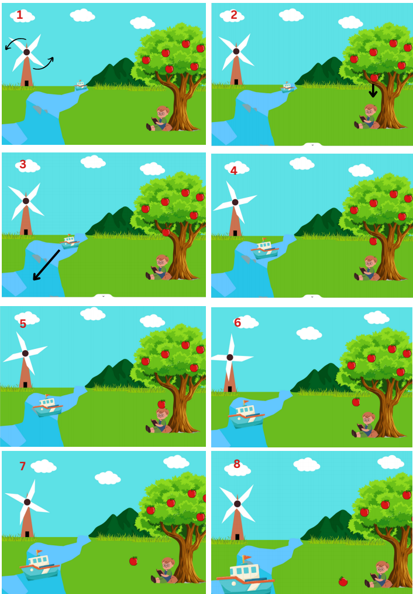

# 0x08 : 2D Animations (Project) #

## Project Assignment##

### Storyboard ###

1. [Git URL](https://github.com/aryantyagi010/Cg-project)
2. Commit ID : a616c5d8ceaf2c58ecd6a3ee4f744675e8ae1901
3. 

### Final Project ###

1. [Git URL](https://github.com/aryantyagi010/Cg-project)
2. Commit ID
3. Storyboard (One image containing the storyboard)
   
4. Teaser
   
 
5. Video Link
[https://drive.google.com/file/d/1iP67Jjp1nO0mH_U2vDYz1H0uflC54kS0/view](https://drive.google.com/file/d/1iP67Jjp1nO0mH_U2vDYz1H0uflC54kS0/view)
